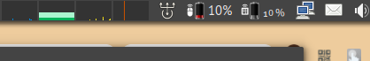

# batterindicator
applet to show in systray the battery status of connected HIDs

you can start two or more instances to see battery status of __both__ keyboard and mouse

1. requirements: python3, gi

2. installation: put the .py file to any folder   
      make sure that icons subfolder is at the same place.    
      chmod +x on this file and put it to autostart. 
                 
3. parameters:

      -k or -m (required) - show state of __k__ eyboard or __m__ ouse   
      -d or -w (optional) - use icons for __d__ ark or __w__ hite theme   
      -p (optional) - show the __p__ ercentage label   
      --l=10 (optional) - override the __l__ evel of low battery warning (1..100 or 0 to off)   
      
